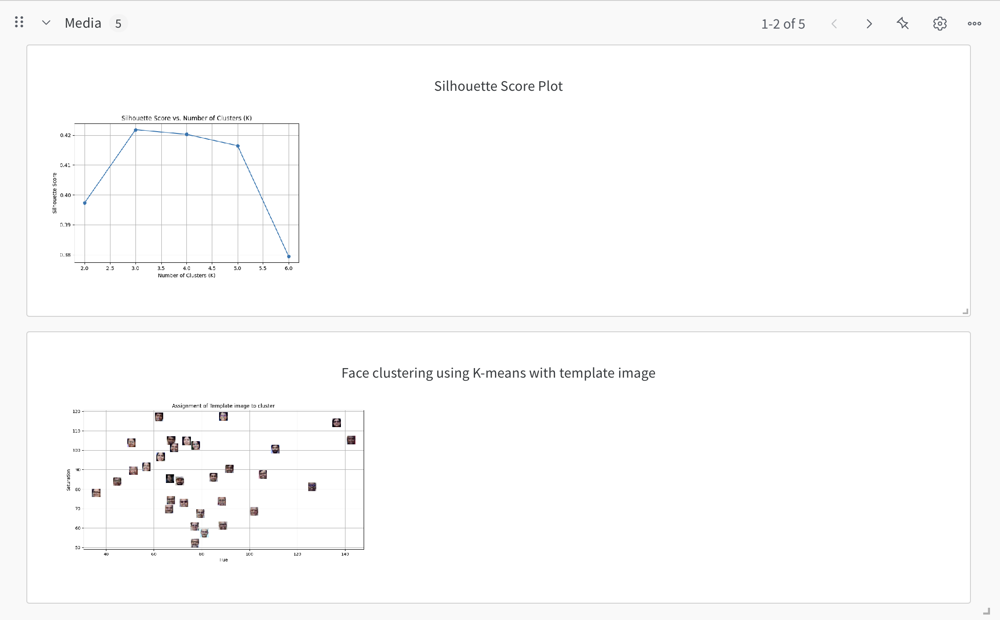
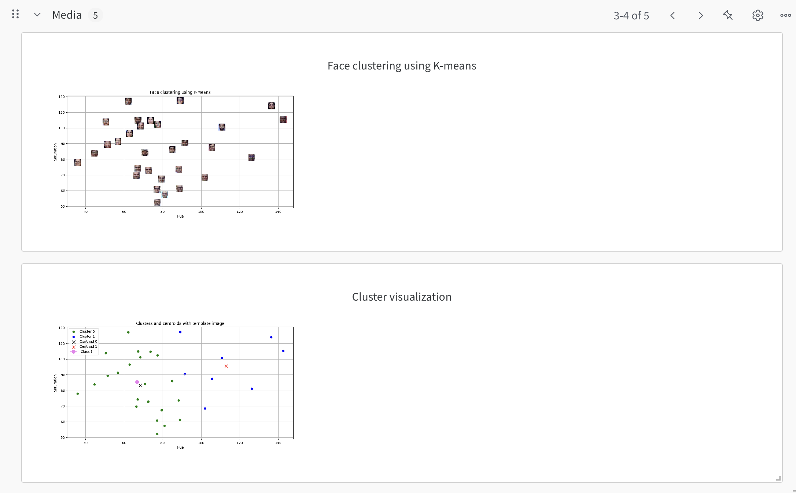
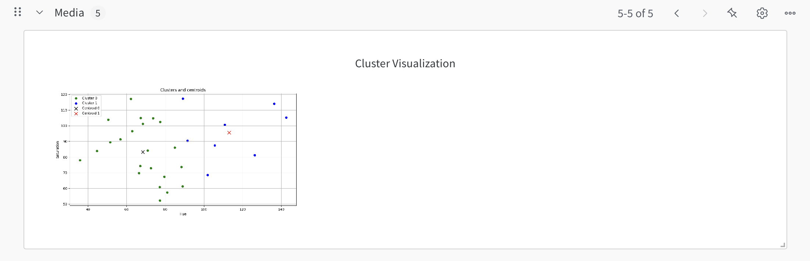

Summary of findings and learnings from the project  

1. Clustering with K-Means: The extracted hue and saturation features were used to cluster faces into two distinct groups using the K-Means algorithm. The resulting clusters and their centroids were visualized in a scatter plot, providing insights into how color features differentiate the faces.  

2. Face Detection & Clustering: The project utilized a Haar Cascade classifier to detect faces in images. This was done by converting the input image to grayscale and applying the detectMultiScale function, which successfully identified facial regions.  

3. Feature Extraction: After detecting faces, each face region was converted from BGR/RGB to HSV color space. The mean hue and saturation values were computed for each face, offering a concise yet informative feature set that captured the underlying color characteristics.  

4. Usage of tools: The project involved working with tools such as WANDB, GitHub, and Docker, each serving specific purposes in tracking experiments, version control, and containerization, respectively.  

This project successfully classified faces using distance-based classification and K-Means clustering.

Screenshots of dashboard of the WANDB:

input images:

output images are contained in the output folder.
